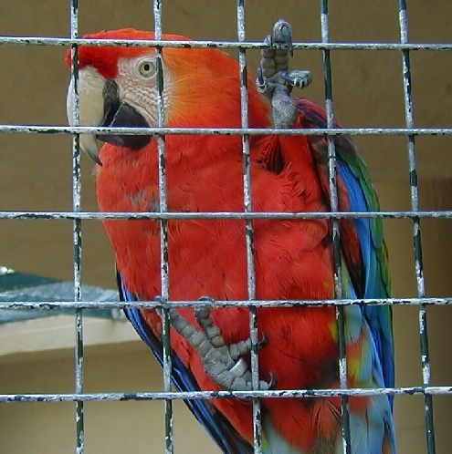
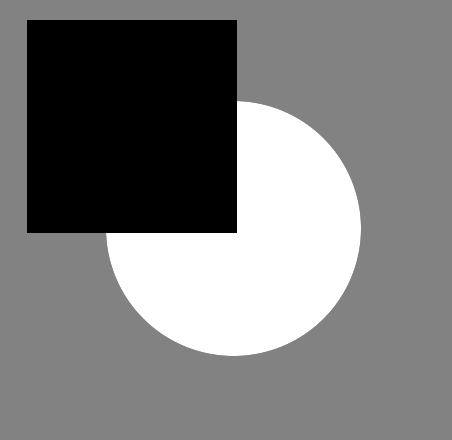
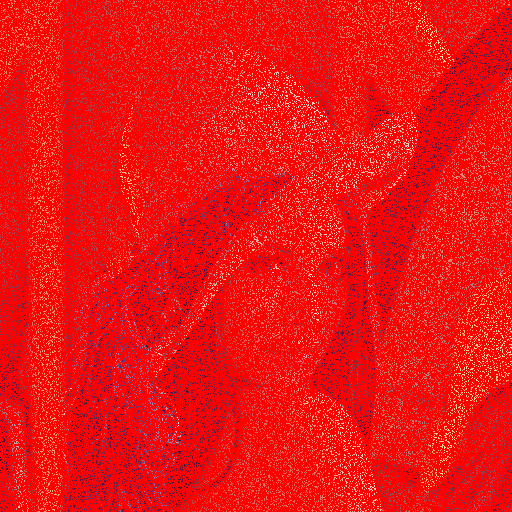
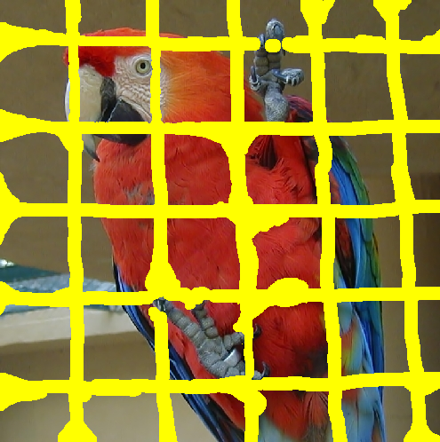
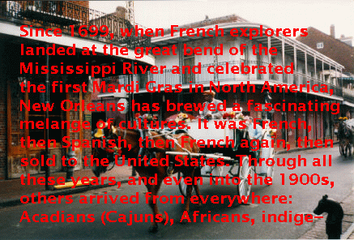

# inpaint

## Description

Documentations for a [M2 project. The goal was to implement an efficient inpainting algorithm.](https://github.com/ImageProcessing-ElectronicPublications/inpaint-cimg)

## Documentations

* Implemented from: [Bornemann.pdf](doc/Bornemann.pdf)
* Baseline: [Telea.pdf](doc/Telea.pdf)
* Report (in french): [rapport.pdf](doc/rapport.pdf)

## Sample image

----

https://github.com/vdel/Inpainting
